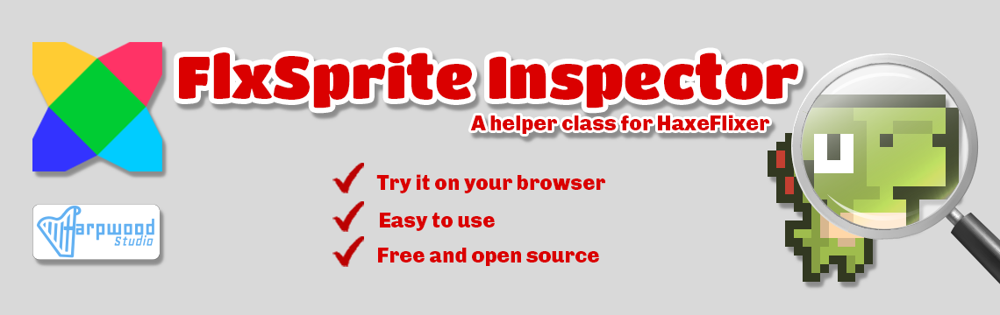

FlxSprite Inspector is a lightweight and efficient tool designed for sprite inspection in HaxeFlixel games. It provides a convenient way to visualize and manipulate the properties of FlxSprite objects, such as offset, origin, rotation, and hitbox, during runtime. The Inspector enhances the debugging and fine-tuning process, allowing developers to optimize the visual aspects of their game sprites. It is meant to be used within HaxeFlixel projects and offers intuitive controls for easy interaction. Contributions and feedback from the community are welcome to improve and expand the functionality of the FlxSprite Inspector.

##### You can test the FlxSprite Inspector directly on your browser by visiting the [FlxSprite Inspector's itch.io page](https://harpwood.itch.io/flxsprite-inspector). 

It provides a live demo where you can experience the functionality and  features of the Inspector firsthand. Feel free to explore and interact  with the Inspector to get a better understanding of its capabilities. 

## Getting Started

### Prerequisites

To use FlxSprite Inspector in your HaxeFlixel projects, ensure that you have the following prerequisites:

- HaxeFlixel framework installed. Refer to the [HaxeFlixel documentation](https://haxeflixel.com/documentation/install-haxeflixel/) for installation instructions.
- Basic knowledge of HaxeFlixel and FlxSprite class usage.

Please make sure that your project meets these prerequisites before incorporating FlxSprite Inspector.

### Installation

Copy the `helpers` folder (package) and its contents into your `source` folder.

That's it! The FlxSprite Inspector is now ready to be used in your project!

### Usage

1. In the `Main.hx` file of your project, add the following code snippet before creating a new `FlxGame()` instance:

```haxe
var launchInspector:Bool = true;

if (launchInspector)
{
	addChild(new FlxGame(1024, 748, FlxSpriteInpsector));
	return;
}
```

> Note: The dimensions `1024x748` are recommended but not  mandatory. You can adjust the width and height to match your game's  resolution. If the Inspector does not look good on your game's  resolution, you can switch to the recommended dimensions.

2. Set the `launchInspector` variable to `true` when you want to use the FlxSprite Inspector. Set it to `false` to start your game as usual.

3. In the `helpers/FlxSpriteInspector.hx` file:

   - In the constructor, below the `super.create();` line, replace `DinoSprite` with the name of your custom `FlxSprite` class.
   - Determine the desired values for offset, origin, and angle for your sprite.
   - Implement these values in your sprite within your game.

## Controls

- `H`: Toggle help visibility on/off
- `Mouse Wheel`: Zoom in/out
- `Arrow Keys`: Move the offset of the sprite by one pixel
- `Shift + Arrow Keys`: Move the offset of the sprite by multiple pixels. The amount varies based on the zoom level.
- `Alt + Arrow Keys`: Move the origin of the sprite by one pixel.
- `Alt + Shift + Arrow Keys`: Move the origin of the sprite by multiple pixels. The amount varies based on the zoom level.
- `Ctrl + Arrow Keys`: Adjust the size of the sprite's hitbox by one pixel.
- `Ctrl + Shift + Arrow Keys`: Adjust the size of the sprite's hitbox by multiple pixels. The amount varies based on the zoom level.
- `Space`: Reset all changes.
- `R`: Toggle sprite rotation on/off.
- `A`: Show and play the previous animation.
- `D`: Show and play the next animation.
- `B`: Darken the background.
- `Shift + B`: Lighten the background.

## License

This project is licensed under the [MIT License](LICENSE.md).

Feel free to contribute, report issues, or suggest improvements by creating an issue or pull request in the repository.

### Roadmap

The FlxSprite Inspector was initially created to fulfill my personal needs as a lightweight and efficient tool for sprite inspection in HaxeFlixel games. I have decided to open source it to benefit the community. However, if there is sufficient interest and demand from the community, I am open to expanding the functionality and incorporating new features to provide a more comprehensive sprite debugging experience.

Your feedback and support will be invaluable in shaping the future development of the FlxSprite Inspector. Stay tuned for updates and thank you for your interest!

### Support Me

If you find the FlxSprite Inspector helpful and would like to support its development, you can consider the following:

- **Star the Repository**: Show your appreciation by starring the [GitHub repository](https://github.com/harpwood/FlxSprite-Inspector). It helps to attract more visibility to the project.

- **Provide Feedback**: If you have any suggestions, bug reports, or feature requests, please open an issue on the repository. Your feedback is valuable in improving the FlxSprite Inspector.

- **Spread the Word**: Share the FlxSprite Inspector with other HaxeFlixel developers who might benefit from it. Let them know about the project and how it can simplify sprite inspection and debugging in their games.

- **Contribute**: If you like to contribute to the project's development, you can submit pull requests with new features, bug fixes, or improvements. Contributions are always welcome!

- On the [FlxSprite Inspector itch.io page](https://harpwood.itch.io/flxsprite-inspector): Click the "Support This FlxSprite Inspector" button and follow the instructions to contribute.

- On the [GitHub repository](https://github.com/harpwood/FlxSprite-Inspector): Click the "Sponsor" button and choose a sponsorship tier that suits you.

Your support is greatly appreciated and will help in maintaining and improving the Inspector. Thank you for your generosity!

I believe that the FlxSprite Inspector will greatly enhance your experience in creating HaxeFlixel games. I hope you find it incredibly useful!


## Credits

Dino character sprite by Arks:
 * Twitter: https://twitter.com/ArksDigital
 * Dino Characters on itch.io : https://arks.itch.io/dino-characters

Support this awesome creator! 
